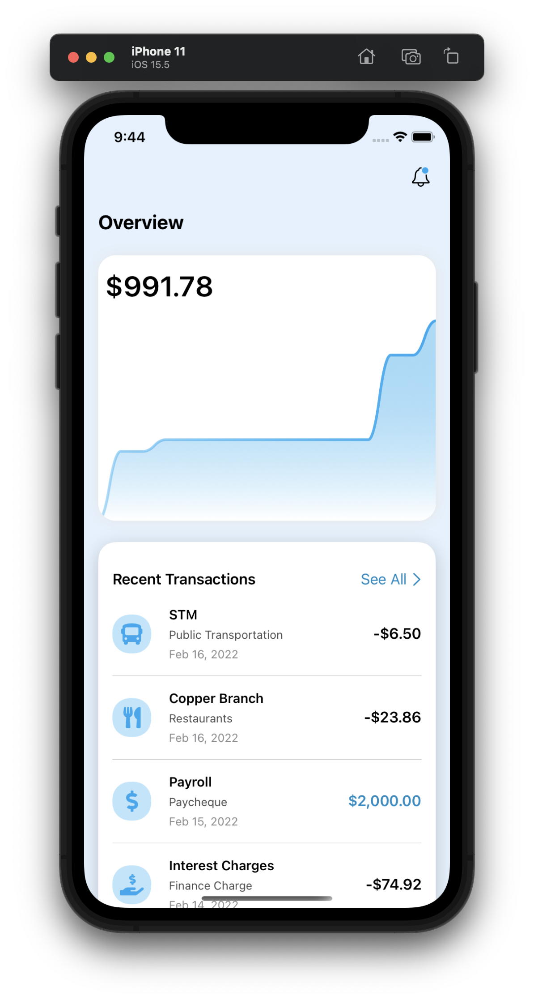
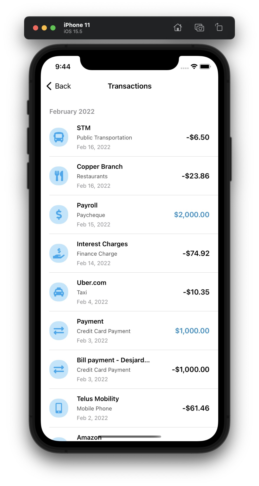

# ExpenseTracker

#### Expense Tracker App:

###### I builded an expense tracker app. The main view features a chart that tracks this month’s spending as of date. If we drag over the chart line, we can see the history of total spending per specific day. 

###### Below, it displays the most recent five transactions that occurred. Each transaction details the merchant, category, date and amount. The amount is negative if it’s a debit or positive and colored if it’s a credit. On the left, we can see the icon associated to the category. 

###### These icons are loaded from a third party library `SwiftUIFontIcon` and mapped through each category. If you click on the See All link, we are redirected to the all transactions screen where they are grouped by month. This app also offers a beautiful dark mode. Beware that this app is data focused. As it is a financial app, we will be performing calculations and apply various logics to resolve the right data.

#### Touching points:
- `@EnvironmentObject`
- `Published`
- `NavigationView`
- `NavigationLink`
- `ColorGradient`
- `ToolbarItem`
- `RoundedRectangle`
- Extensions
- Dark Mode

#### Dependecies used:
- `SwiftUIFontIcon`
- `SwiftUICharts`

---

#### App Demo.
<table>
  <tr>
    <td>Home Screen</td>
	<td>Transactions Screen</td>
	<td>Video</td>
  </tr>
  <tr>
    <td></td>
    <td></td>
    <td>
		<video width="270" height="480" controls>
			<source src="Assets/Video/DemoVideo.mp4" type="video/mp4">
		</video>
    </td>
  </tr>
</table>

---

Source of the project: [Design Code](https://www.youtube.com/watch?v=Bu6fAlltatA)
